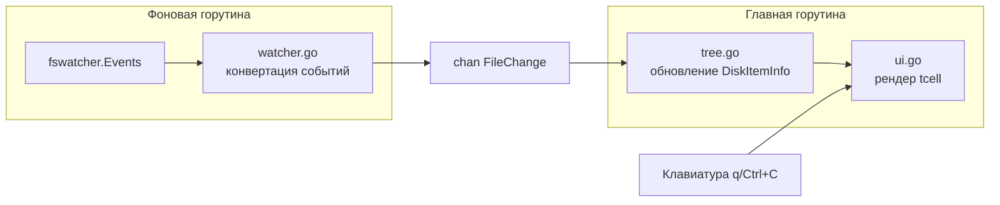

# Plan: Folder Monitor TUI

## Анализ плана и уточнения

**Найденные технические детали `github.com/sgtdi/fswatcher`:**
- Тип события: `EventCreate`, `EventMod`, `EventRemove`, `EventRename`, `EventChmod`
- Структура: `WatchEvent{Path string, Types []EventType, Time time.Time}`
- Дебаунс встроен, настраивается `WithCooldown(300*time.Millisecond)`
- На Windows rename → **два отдельных события** с `EventRename`: одно на старый путь, одно на новый

**Уточнения к исходному плану:**

- Поля `name`, `size`, `fullPath` в `FileChange` — типы `string`, `int64`, `string`
- `fullPath` в `FileChange` — **относительно** `RootFolder` (обрезаем префикс из абсолютного пути fswatcher)
- При `EventRemove` файл уже не существует → `isFile` и `size` берём из дерева `DiskItemInfo`
- При агрегации нескольких типов в одном событии — приоритет: `Remove > Rename > Create > Modified`
- `DiskItemInfo.items` — срез, линейный поиск по имени достаточен для типичных деревьев
- Потокобезопасность: дерево читает/пишет горутина watcher'а и горутина UI → `sync.RWMutex`

---

## Структура проекта

```
folder-monitor/
├── main.go      # CLI-аргументы, инициализация, запуск горутин
├── types.go     # FileChangeType, FileChange, DiskItemInfo
├── watcher.go   # Обёртка над fswatcher, конвертация WatchEvent → FileChange
├── tree.go      # Начальное сканирование, поиск/добавление/удаление узлов
├── ui.go        # Рендеринг дерева через tcell
├── go.mod
└── go.sum
```

---

## Архитектура потоков данных



---

## Фаза 1: Foundation — типы и зависимости

**Файлы:** `go.mod`, `types.go`

- Добавить зависимости: `go get github.com/sgtdi/fswatcher@v1.2.0` и `go get github.com/gdamore/tcell/v2`
- Определить все типы в `types.go`:

```go
type FileChangeType int
const (
    None     FileChangeType = iota
    Created                 // 1
    Modified                // 2
    Renamed                 // 3
    Removed                 // 4
)

type FileChange struct {
    Time       time.Time
    ChangeType FileChangeType
    IsFile     bool
    Name       string
    Size       int64
    FullPath   string  // relative to RootFolder
}

type DiskItemInfo struct {
    Name       string
    IsFile     bool
    Size       int64
    Items      []*DiskItemInfo
    ChangeType FileChangeType
    ChangeTime time.Time
}
```

- Константа `DefaultRootFolder = "."` в `main.go`
- Парсинг аргумента: `flag.StringVar(&rootFolder, "path", DefaultRootFolder, "...")`

---

## Фаза 2: Tree — дерево в памяти

**Файл:** `tree.go`

- `ScanDir(root string) (*DiskItemInfo, error)` — рекурсивный обход через `os.ReadDir`, заполняет дерево, `ChangeType = None`
- `FindNode(root *DiskItemInfo, relPath string) *DiskItemInfo` — поиск узла по относительному пути
- `AddNode(root *DiskItemInfo, change FileChange)` — создаёт недостающие промежуточные узлы
- `RemoveNode(root *DiskItemInfo, relPath string)` — удаляет узел из родительского `Items`
- `ApplyChange(root *DiskItemInfo, ch FileChange)` — диспетчер: Created/Modified → upsert, Removed → RemoveNode, Renamed → RemoveNode(old) + AddNode(new, Renamed)
- Поля `ChangeType` и `ChangeTime` на узле обновляются при каждом `ApplyChange`

---

## Фаза 3: Watcher — мониторинг файлов

**Файл:** `watcher.go`

- Инициализация: `fswatcher.New(fswatcher.WithPath(rootFolder), fswatcher.WithCooldown(300*time.Millisecond))`
- Конвертация `WatchEvent` → `FileChange`:
  - Приоритет типов: `EventRemove > EventRename > EventCreate > EventMod`
  - `fullPath` = `strings.TrimPrefix(event.Path, rootFolder)`
  - Для `EventCreate`/`EventMod`/`EventRename(new)`: `os.Stat(event.Path)` → `IsFile`, `Size`
  - Для `EventRemove`/`EventRename(old)`: `os.Stat` недоступен → `isFile` и `size` берутся из `FindNode` в дереве
- **Rename-логика на Windows** (два события с `EventRename`):
  - Если путь **есть** в дереве → старое имя → отправить `Removed`
  - Если пути **нет** в дереве → новое имя → отправить `Renamed`
- Сигнатура: `func RunWatcher(ctx context.Context, rootFolder string, tree *DiskItemInfo, mu *sync.RWMutex, out chan<- FileChange)`

---

## Фаза 4: UI — отрисовка через tcell

**Файл:** `ui.go`

- Инициализация `tcell.NewScreen()`
- Функция `renderTree(s tcell.Screen, root *DiskItemInfo, mu *sync.RWMutex)` — рекурсивный обход:
  - Каталоги сначала, затем файлы (на каждом уровне)
  - Отступ пропорционален глубине
  - Файл: `|-filename.ext   34 Kb`
  - Каталог: `|+SubFolder/`
  - Вспомогательная функция форматирования размера: `b / Kb / Mb / Gb`
- Главный цикл: `select` на `tcell.PollEvent()` + `updateChan <-chan FileChange`
  - При получении `FileChange` → `ApplyChange` → `renderTree`
  - `tcell.EventResize` → `s.Sync()` + перерисовка
  - `tcell.EventKey` `q` / `Ctrl+C` → `cancel()`

---

## Фаза 5: Интеграция — main.go

**Файл:** `main.go`

```
main():
  1. Парсинг флагов (rootFolder)
  2. ScanDir(rootFolder) → tree
  3. Инициализация tcell screen
  4. ctx, cancel = context.WithCancel(context.Background())
  5. go RunWatcher(ctx, rootFolder, tree, &mu, updateChan)
  6. RunUI(ctx, cancel, screen, tree, &mu, updateChan)  ← блокирует
  7. defer screen.Fini()
```

---

## Зависимости между фазами

- Фаза 1 → независима
- Фаза 2 → требует Фазу 1 (типы)
- Фаза 3 → требует Фазы 1 и 2 (типы + дерево для Rename-lookup)
- Фаза 4 → требует Фазу 2 (дерево для рендера)
- Фаза 5 → требует все фазы
